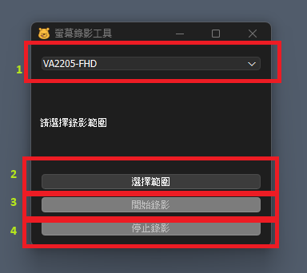
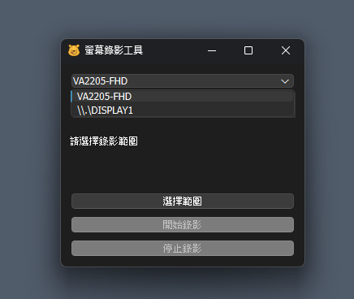
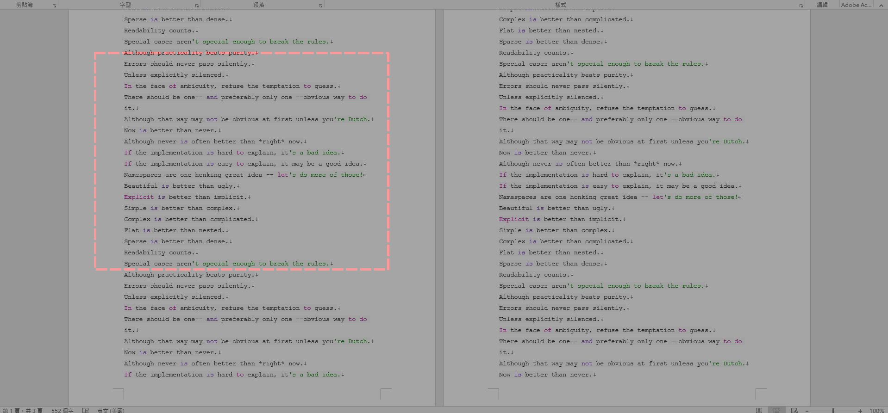
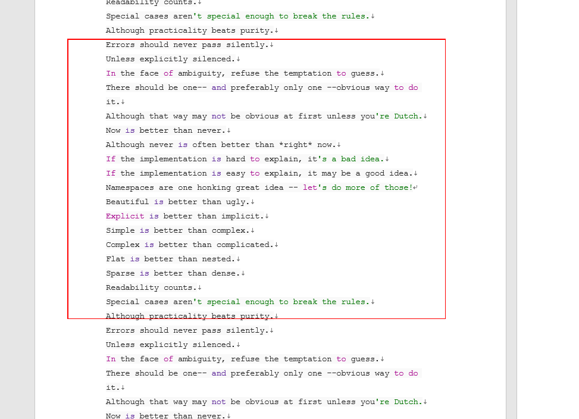
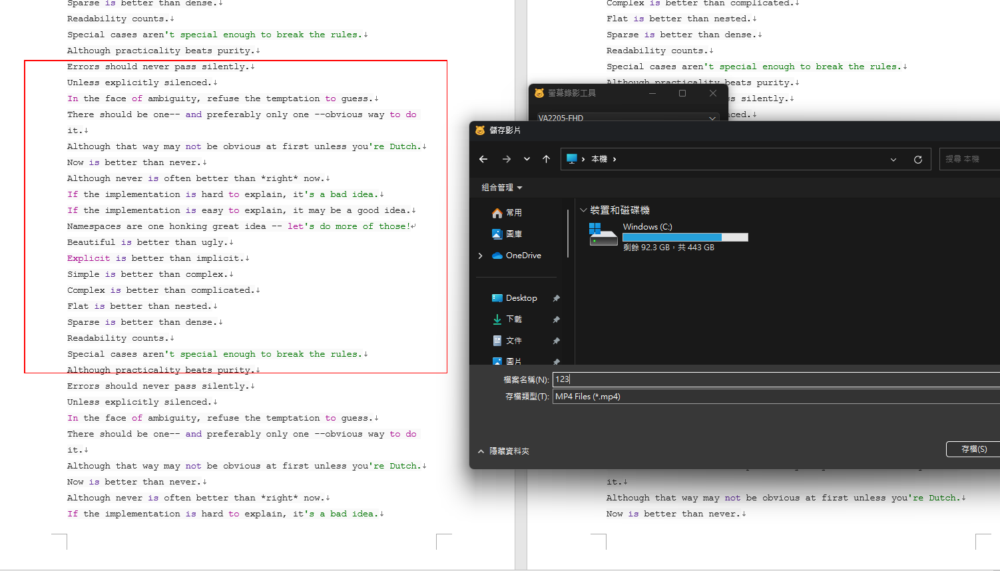
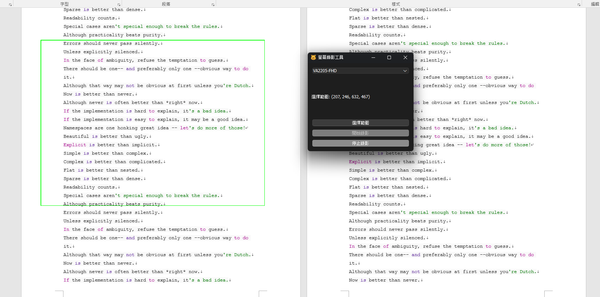
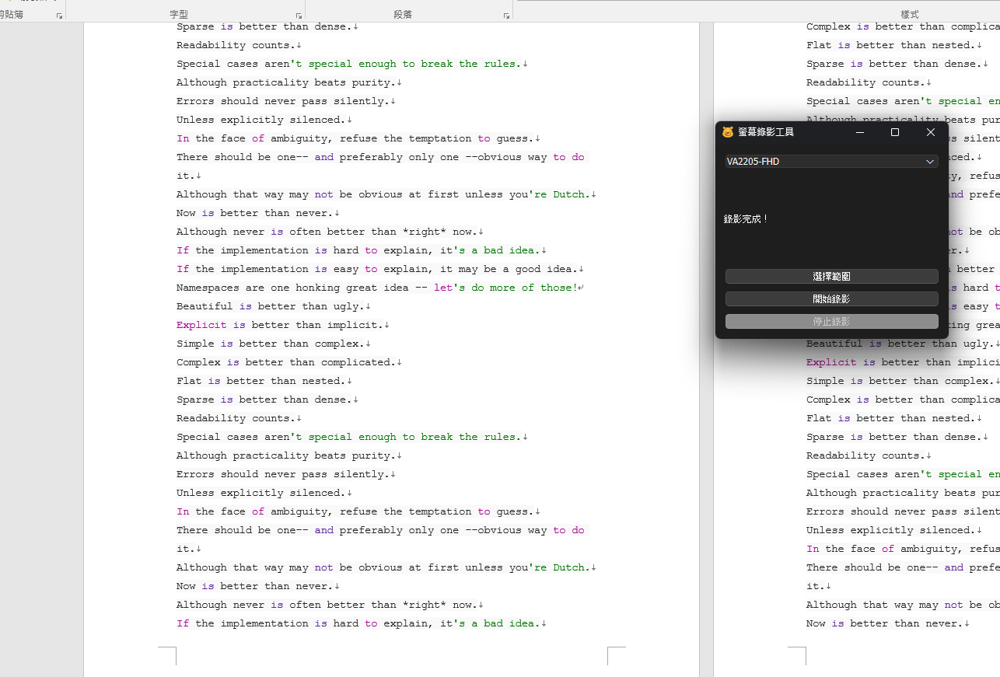

# record_tool
free  screen recording tool for everyone

## 操作步驟
1. 介面介紹  
    (1) 螢幕選擇 (如果你是多螢幕)  
    (2) 選擇錄製範圍  
    (3) 開始錄影 & 選擇儲存位置  
    (4) 停止錄影  
      
    
2. 螢幕選擇  
    下拉選單選取你要錄影的螢幕  
      
3. 選取錄影範圍  
    使用滑鼠拖曳拉出要錄影的範圍  
      
4. 確認範圍  
    拖曳完成後、錄影之前，方框會呈現亮紅色  
      
5. 開始錄影 & 儲存  
    按下開始錄影，先選擇影片儲存位置  
      

    當錄製範圍由紅框變為綠框，表示錄影進行中  
      
6. 結束錄影  
    按下按鈕結束錄影，錄影結束後方框會消失，檔案會在你選擇的位置  
      